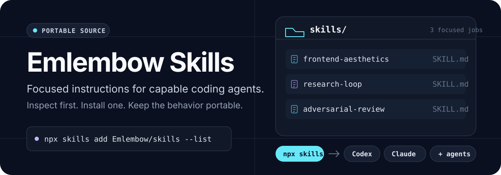

<p align="center">
  
</p>

<p align="center">
  <a href="https://agentskills.io/">Agent Skills</a> ·
  <a href="#choose-a-skill">Browse the collection</a> ·
  <a href="CONTRIBUTING.md">Contribute</a> ·
  <a href="LICENSE">MIT licensed</a>
</p>

Focused, portable instructions for Codex, Claude Code, and other coding agents that support the Agent Skills format. Each skill does one job, keeps its behavior in a standard `SKILL.md`, and includes host metadata only where a host needs it.

## Start with the catalog

Inspect every available portable skill before installing anything:

```bash
npx skills add Emlembow/skills --list
```

Project scope is the default and is usually the safest choice for a team repository. This collection is installed from GitHub with `npx skills add Emlembow/skills`; it is not an npm package.

## Choose a skill

| Skill | Best for |
| --- | --- |
| [`frontend-aesthetics`](skills/frontend-aesthetics/) | Distinctive web interfaces that keep accessibility, product context, and existing design systems intact |
| [`research-loop`](skills/research-loop/) | Metric-driven implementation experiments protected by holdout and leakage checks |
| [`adversarial-review`](skills/adversarial-review/) | Two independent attempts to disprove a versioned, digest-checked result |

`adversarial-review` is also indexed on [skills.sh](https://skills.sh/Emlembow/skills/adversarial-review). GitHub-hosted skills appear there after an install through the `skills` CLI with anonymous telemetry enabled.

## Install exactly what you need

Every portable skill can be selected independently:

```bash
npx skills add Emlembow/skills --skill frontend-aesthetics
npx skills add Emlembow/skills --skill research-loop
npx skills add Emlembow/skills --skill adversarial-review
```

To install a reviewed skill for a specific agent at user scope, be explicit:

```bash
npx skills add Emlembow/skills --skill frontend-aesthetics --agent codex --global --yes
npx skills add Emlembow/skills --skill frontend-aesthetics --agent claude-code --global --yes
```

The CLI recommends symlink installation. Use `--copy` only when the target environment cannot use symlinks. Update project-scoped skills with `npx skills update -p`, or user-scoped skills with `npx skills update -g`.

> **Review before granting access.** Skills can contain executable scripts. Read a skill and its bundled resources before giving it access to sensitive repositories, credentials, or external systems. Set `DISABLE_TELEMETRY=1` or `DO_NOT_TRACK=1` when telemetry must be disabled.

## Portable at the core

The repository keeps reusable behavior separate from host presentation and distribution:

```text
skills/<skill-name>/
├── SKILL.md              # portable behavior and trigger rules
├── agents/openai.yaml    # Codex display metadata
├── references/           # optional focused detail
├── scripts/              # deterministic helpers, only when needed
└── .claude-plugin/       # Claude plugin metadata, when distributed there
```

- The top-level `skills/` folders are the source discovered by `npx skills`.
- `agents/openai.yaml` adds Codex presentation without changing portable behavior.
- Claude plugin manifests and marketplaces point back to the same skill folders.
- Repository validation checks structure, metadata, discovery, and marketplace paths together.

## Create or contribute a skill

Use the creator built into your agent when available (`$skill-creator` in Codex), or initialize a portable skill with:

```bash
npx skills init my-skill
```

Keep `SKILL.md` focused on one job. Put trigger and non-trigger conditions in its frontmatter `description`, write imperative steps with explicit inputs and outputs, and move optional detail into one-level-deep `references/`. Add `agents/openai.yaml` for Codex presentation metadata.

See [CONTRIBUTING.md](CONTRIBUTING.md) for the complete repository requirements.

## Validate the collection

The automated checks pin tool versions for reproducibility even though end-user examples use the official unversioned `npx skills` form.

```bash
npm run validate
```

This checks repository structure, skill metadata, top-level portable discovery, and the Claude marketplace. Pull requests and pushes to `main` run the same validation in GitHub Actions.

## References

- [OpenAI: Build skills](https://developers.openai.com/codex/skills/)
- [Agent Skills specification](https://agentskills.io/specification)
- [`skills` CLI reference](https://www.skills.sh/docs/cli)
- [Claude Code skills](https://code.claude.com/docs/en/slash-commands)

## License

MIT. See [LICENSE](LICENSE).
